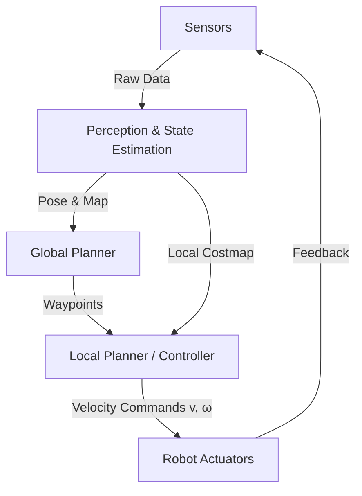

# 🚀 Advanced Hybrid Navigation Frameworks for Autonomous Mobile Robots

### A Comprehensive Technical Analysis

> **Scope**: This repository presents an in-depth, system-level analysis of **Hybrid Navigation Frameworks** for Autonomous Mobile Robots (AMRs), integrating **classical planning**, **probabilistic state estimation**, **reactive control**, and **learning-based intelligence** under real-world computational constraints.

---

## 📌 Table of Contents

1. [Theoretical Foundations & Architectural Paradigms](#1-theoretical-foundations--architectural-paradigms)
2. [Global Path Planning: Algorithms & Optimization](#2-global-path-planning-algorithms--optimization)
3. [Perception & Environmental Representation](#3-perception--environmental-representation)
4. [State Estimation & Sensor Fusion](#4-state-estimation--sensor-fusion)
5. [Local Reactive Control: Dynamic Window Approach](#5-local-reactive-control-the-dynamic-window-approach)
6. [Computational Constraints & Embedded Hardware](#6-computational-constraints--embedded-hardware)
7. [Motion Profiles & Actuator Control](#7-motion-profiles--actuator-control)
8. [Recovery Behaviors & Fault Tolerance](#8-recovery-behaviors--fault-tolerance)
9. [Conclusion](#9-conclusion)

---

## 1. Theoretical Foundations & Architectural Paradigms

Autonomous navigation in **unstructured and dynamic environments** requires reconciling two fundamentally opposing requirements:

* **Global Optimality** (long-horizon reasoning)
* **Real-time Responsiveness** (short-horizon reaction)

The **Hybrid Navigation Framework** resolves this conflict through **hierarchical decomposition**, decoupling planning timescales while maintaining closed-loop feedback.

---

### 1.1 The Dichotomy of Deliberation and Reaction

#### 🔹 Deliberative Systems

* Operate on **complete static maps**
* Use **graph search algorithms** (A*, Dijkstra)
* Produce **globally optimal paths**
* ❌ High computational latency
* ❌ Cannot react to sub-second disturbances

#### 🔹 Reactive Systems

* Operate directly on **sensor data**
* Examples: Artificial Potential Fields (APF), Follow-the-Gap
* ✔ Extremely low latency
* ❌ No global context
* ❌ Prone to **local minima** (U-shaped traps, dead ends)

#### ✅ Hybrid Solution

| Layer          | Frequency | Responsibility                             |
| -------------- | --------- | ------------------------------------------ |
| Global Planner | 0.1–2 Hz  | Long-horizon, topological planning         |
| Local Planner  | 10–20 Hz  | Collision avoidance, kinematic feasibility |
| Controller     | 50–100 Hz | Actuator-level stability                   |

---

### 1.2 System Architecture Diagram



---

### 1.3 Hierarchical Decomposition

#### 🧠 Perception & State Estimation

* Sensor fusion of **encoders, IMU, LiDAR, cameras**
* Pose:
  [
  \mathbf{x} = [x, y, \theta]^T
  ]

#### 🗺 Global Path Planning

* Static occupancy grid
* Waypoint sequence:
  [
  {w_1, w_2, \dots, w_n}
  ]

#### 🚗 Local Trajectory Generation

* Samples velocity space:
  [
  (v, \omega)
  ]
* Optimizes clearance, smoothness, and goal progress

#### ⚙ Low-Level Control

* PID / feedback control
* Converts velocity commands into PWM or torque

---

## 2. Global Path Planning: Algorithms & Optimization

Global planners treat the environment as a **graph**:

* Nodes → robot configurations
* Edges → feasible transitions

---

### 2.1 Graph Search Algorithms

#### A* Cost Function

[
f(n) = g(n) + h(n)
]

| Algorithm | Optimality                | Speed           | Path Quality |
| --------- | ------------------------- | --------------- | ------------ |
| Dijkstra  | Guaranteed                | Slow            | Smooth       |
| A*        | Guaranteed (admissible h) | ~35% faster     | Smooth       |
| RRT       | No                        | Fast (high-dim) | Jagged       |

📌 **Observation**:
A* outperforms Dijkstra by ~35% in cluttered indoor maps, but produces **grid-constrained paths** requiring smoothing (B-splines, gradient descent).

---

### 2.2 Sampling-Based Planners (RRT / RRT*)

* Suitable for **high-dimensional spaces**
* Probabilistic completeness
* RRT* → asymptotic optimality

**Empirical Results**

* Path length: **~17% longer than A***
* Control effort: **~38% higher**
* Memory growth: **Unbounded**

🛠 **Solution**: MA-RRT*FN (Fixed-Node)
Limits memory by pruning weak nodes.

---

### 2.3 Emerging Paradigms: LLM-Driven Planning

**Grid2Guide Framework**

* A* on binary occupancy grid
* Vectorization + Run-Length Encoding (RLE)
* Output:

```text
"Walk 5 meters north, then turn east..."
```

✔ Enables **human-robot collaboration**
✔ Bridges symbolic planning and natural language

---

### 2.4 Replanning Strategies

| Strategy         | Success Rate | Collision Rate | Replans  | Notes         |
| ---------------- | ------------ | -------------- | -------- | ------------- |
| Stuck-based      | 64%          | 13%            | 739      | Late reaction |
| Fixed-time       | 70%          | 10%            | 3076     | CPU-intensive |
| **DRL Adaptive** | **77%**      | **4%**         | **2577** | Best balance  |

---

## 3. Perception & Environmental Representation

---

### 3.1 Costmap Architecture (ROS 2 Nav2)

**Layered Costmap**

* Static Layer
* Obstacle Layer
* Inflation Layer

#### Cost Semantics

| Value | Meaning            |
| ----- | ------------------ |
| 254   | LETHAL_OBSTACLE    |
| 253   | INSCRIBED_INFLATED |
| 0     | FREE_SPACE         |

#### Inflation Cost Function

[
C(d) = e^{-\alpha(d - r_{inscribed})} \cdot 252
]

| α Value     | Behavior                     |
| ----------- | ---------------------------- |
| High (10.0) | Aggressive, tight turns      |
| Low (2.0)   | Conservative, center-of-hall |

---

### 3.2 Visual Perception with CNNs

**GoogLeNet (Inception v1)**

* Parallel kernels: (1\times1, 3\times3, 5\times5)
* Bottleneck layers reduce computation
* Suitable for **embedded real-time inference**

---

## 4. State Estimation & Sensor Fusion

---

### 4.1 Extended Kalman Filter (EKF)

**State Vector**
[
\mathbf{x} = [x, y, \theta, v_x, v_y, \omega, a_x, a_y]^T
]

| Step       | Frequency | Sensors                  |
| ---------- | --------- | ------------------------ |
| Prediction | 100 Hz    | Encoders, IMU            |
| Correction | 5–10 Hz   | LiDAR SLAM / Visual SLAM |

---

### 4.2 SLAM Evaluation Metrics

#### Absolute Trajectory Error (ATE)

[
ATE_{rmse} = \left(\frac{1}{n} \sum ||Q_i^{-1} S P_i||^2\right)^{1/2}
]

* Measures **global consistency**
* Loop closures reset drift

#### Relative Pose Error (RPE)

* Measures **local smoothness**
* Critical for feedback control

---

## 5. Local Reactive Control: The Dynamic Window Approach

---

### 5.1 DWA Configuration (ROS)

```yaml
DWAPlannerROS:
  max_vel_x: 0.5
  acc_lim_x: 2.5
  sim_time: 1.7
  vx_samples: 6
  vtheta_samples: 20
  path_distance_bias: 32.0
  goal_distance_bias: 24.0
  occdist_scale: 0.01
```

⚠ **Common Pitfall**
Large `sim_time` × high samples ⇒ control rate < 10 Hz ⇒ unsafe behavior.

---

### 5.2 Hybrid Switching: DRL + DWA

| Scenario     | Planner    |
| ------------ | ---------- |
| Open Space   | DWA        |
| Dense Crowds | DRL Policy |

📈 **26% improvement** in navigation time
🧠 Eliminates “freezing robot” problem

---

## 6. Computational Constraints & Embedded Hardware

---

### 6.1 Hardware Benchmarks

| Task         | Raspberry Pi 4 | Jetson Nano | Gain        |
| ------------ | -------------- | ----------- | ----------- |
| YOLOv3       | 1 FPS          | 25 FPS      | ~20×        |
| ORB-SLAM     | 2–4 FPS        | 12–18 FPS   | Real-time   |
| Power (Load) | 7 W            | 10 W        | Jetson GPU  |
| Thermal      | Throttles      | Stable      | Jetson wins |

---

### 6.2 Memory Bottlenecks

* VINS-Mono: **2–3 GB RAM**
* Crashes on 4 GB systems
* Solutions:

  * Sliding window optimization
  * Keyframe limits
  * Fixed-node planners

---

## 7. Motion Profiles & Actuator Control

---

### 7.1 Trapezoidal Velocity Profile

[
v(t) =
\begin{cases}
a t & t < t_{acc} \
V_{max} & t_{acc} \le t < t_{dec} \
V_{max} - a(t - t_{dec}) & t \ge t_{dec}
\end{cases}
]

✔ Prevents wheel slip
✔ Reduces mechanical wear
✔ Ensures distance accuracy

---

## 8. Recovery Behaviors & Fault Tolerance

| Behavior          | Purpose                 |
| ----------------- | ----------------------- |
| Oscillation Reset | Detects stuck motion    |
| Costmap Clearing  | Removes ghost obstacles |
| Rotate Recovery   | Sensor refresh          |

⚙ **Critical Parameter**

```yaml
min_in_place_rotational_vel: 0.4  # rad/s
```

Too low ⇒ static friction ⇒ failure

---

## 9. Conclusion

✔ **A*** is the optimal global planner for static maps (35% faster than Dijkstra)
✔ **DWA** remains robust when tuned correctly
✔ **DRL-based adaptive replanning** improves success rate by **13%**
✔ **Jetson Nano** is the minimum viable platform for vision-based navigation
✔ Hybrid frameworks are essential for **scalable, socially-aware autonomy**


